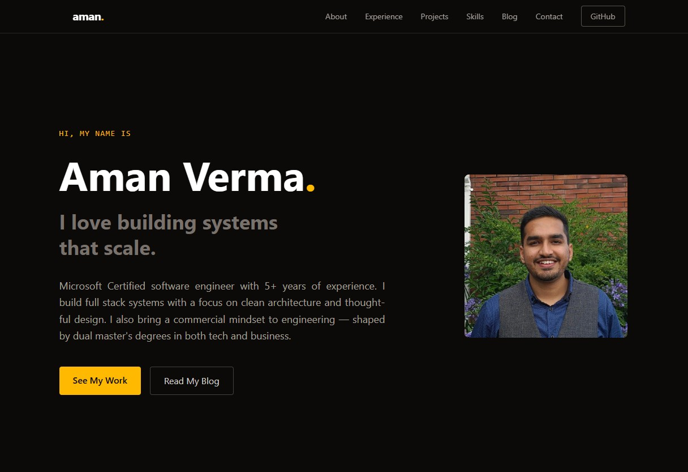

# aman-vr.vercel.app

Personal portfolio website built with React and Tailwind CSS. Deployed on Vercel.



Live: [aman-vr.vercel.app](https://aman-vr.vercel.app)

## Tech Stack

- [React](https://react.dev/) — UI framework
- [Vite](https://vitejs.dev/) — build tool
- [Tailwind CSS v4](https://tailwindcss.com/) — styling
- [Framer Motion](https://www.framer.com/motion/) — animations
- [react-icons](https://react-icons.github.io/react-icons/) — icons

## Project Structure

```
src/
├── data/
│   └── profile.js       # All personal content lives here
├── components/
│   ├── Navbar.jsx
│   ├── Hero.jsx
│   ├── About.jsx
│   ├── Skills.jsx
│   ├── Experience.jsx
│   ├── Projects.jsx
│   ├── Blog.jsx
│   ├── Contact.jsx
│   └── Footer.jsx
├── App.jsx
└── index.css
```

## Customising for Someone Else

All personal content is centralised in `src/data/profile.js`. To use this as a template:

1. Fork or clone the repo
2. Update `src/data/profile.js` with new personal details
3. Set `VITE_APP_URL` in `.env` to your deployed URL (used for OG meta tags)
4. Drop your CV as `public/AmanVerma-CV.pdf` to enable the Resume button in the navbar
5. Deploy to Vercel

## Getting Started

```bash
# Install dependencies
npm install

# Start dev server
npm run dev

# Build for production
npm run build
```

## Deployment

Deployed on [Vercel](https://vercel.com). Every push to `main` triggers an automatic deployment.

## Sections

| Section           | Description                                          |
| ----------------- | ---------------------------------------------------- |
| Hero              | Name, tagline, bio, CTA buttons                      |
| About             | Bio paragraphs, interests, education                 |
| Skills            | Certifications, tech stack, publications             |
| Experience        | Work history timeline                                |
| Projects          | Featured projects with tech tags and links           |
| Blog              | Writing placeholder                                  |
| Contact           | Email CTA, social links                              |
